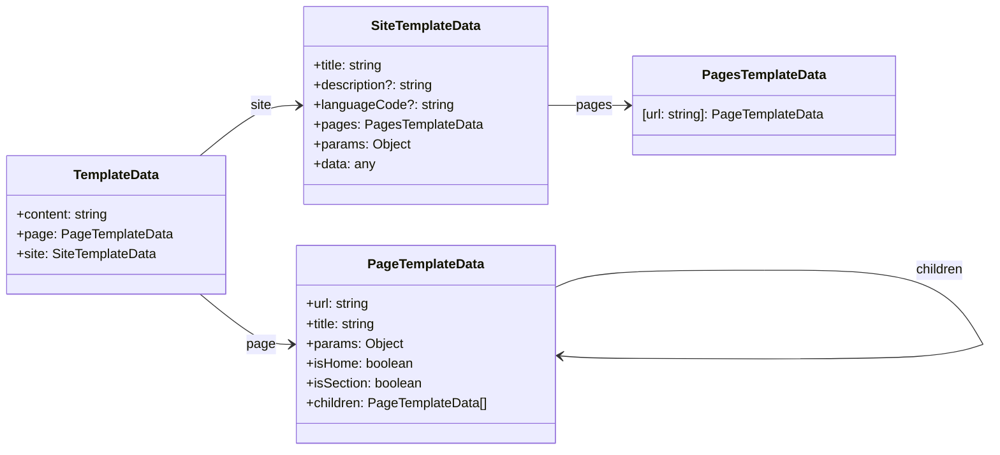

# Create a new project

Run the following commands to setup a new project:

```console
$ mkdir my-website
$ cd my-website
$ npm init
$ npm install --save-dev linkdd/gin@v0.2.0
$ npx gin init .
```

This should create the following tree:

- <i class="fas fa-folder-open"></i> `my-website/`
  - <i class="fas fa-file"></i> `config.yaml` &mdash; This is the project's configuration
  - <i class="fas fa-folder-open"></i> `content/` &mdash; This is where we put the website's pages
    - <i class="fas fa-file"></i> `_index.md`
  - <i class="fas fa-folder-open"></i> `templates/` &mdash; This is where we put the HTML templates
    - <i class="fas fa-folder-open"></i> `layouts/` &mdash; Each page can define a layout, if none is specified, `_default` is used
      - <i class="fas fa-file"></i> `base.html`
      - <i class="fas fa-folder-open"></i> `_default/` &mdash; A layout must contain 3 templates:
        - <i class="fas fa-file"></i> `home.html` &mdash; One for the homepage
        - <i class="fas fa-file"></i> `section.html` &mdash; One for a page with children
        - <i class="fas fa-file"></i> `single.html` &mdash; One for a page with no children
  - <i class="fas fa-folder-open"></i> `data/` &mdash; This is where we put static data (could be fetched from an API or a database)
  - <i class="fas fa-folder-open"></i> `static/` &mdash; This is where we put static files (images, CSS, scripts, ...)

{.tree}

---

# Website content

In the `content/` folder, we will find for example:

- <i class="fas fa-folder-open"></i> `content/`
  - <i class="fas fa-file"></i> `_index.md` &mdash; Template `home.html`
  - <i class="fas fa-file"></i> `about.md` &mdash; Template `single.html`
  - <i class="fas fa-folder-open"></i> `posts/`
    - <i class="fas fa-file"></i> `_index.md` &mdash; Template `section.html`
    - <i class="fas fa-file"></i> `01-hello.md` &mdash; Template `single.html`

{.tree}

<div class="grid grid-cols-3">
<div class="[&>p]:text-center">

Every Markdown file will have a **frontmatter** header:

```markdown
---
title: Page title
weight: 0
layout: _default # optional

foo: bar
---

Page content (in markdown)
```

</div>
<div class="[&>p]:text-center">

The content can contain HTML:

```markdown
---
title: Example
---

<div class="foo">

# Hello in a div

</div>
```

</div>
<div class="[&>p]:text-center">

As well as Twing template directives:

```markdown
---
title: Example

items:
  - foo
  - bar
  - baz
---

{{ "" }}
- {{ "{{ item }}" }}
{{ "" }}
```

</div>
</div>

<article class="p-3 my-6 border-l-8 border-paynegrey bg-paynegrey/50 shadow-md">

<div class="flex items-center">
<div class="w-1/2">

**NB:** Includes are resolved from the `templates/shortcodes/` folder, the
following example will render the template `templates/shortcodes/hello.html` in
your document:

</div>
<div class="w-1/2">

```markdown
---
title: Example
---

{{ "" }}
```

</div>
</div>

</article>

---

# Website layouts

<div class="flex items-center">
<div class="w-1/2">

In a document's frontmatter, if the key `layout` is specified, **Gin** will look
for templates in the `templates/layout/{layout}/` folder. If not specified, the
layout `_default` is assumed.

In the following example, **Gin** will look for templates in the
`templates/layout/foo/` folder:

</div>
<div class="w-1/2">

```markdown
---
title: Example
layout: foo
---

# Hello
```

</div>
</div>

There are 3 kinds of documents:

| Document type | Location in content directory | Template |
| --- | --- | --- |
| The homepage | `content/_index.md` | `templates/layouts/{layout}/home.html` |
| A section | `content/**/_index.md` | `templates/layouts/{layout}/section.html` |
| A single page | `content/**/*.md` | `templates/layouts/{layout}/single.html` |
{.table}

Each document **AND** template have  access to the following data:



For example, a section template could look like this:

```html
<html>
  <head>
    <title>{{ "{{ site.title }} - {{ page.title }}" }}</title>
  </head>

  <body>
    <nav>
      {{ "" }}
        <a href="{{ "{{ child.url }}" }}">{{ "{{ child.title }}" }}</a>
      {{ "" }}
    </nav>

    <main>
      {{ "{{ content|raw }}" }}
    </main>
  </body>
</html>
```

<article class="p-3 my-6 border-l-8 border-paynegrey bg-paynegrey/50 shadow-md">

**NB:** Layout templates will resolve templates from the `templates/` folder.

</article>

One common use case is to have a root template `templates/base.html` and have
your layout templates inherit from it:

<div class="flex">
<div class="w-1/2 [&>p]:text-center">

**templates/base.html**

```html
<html>
  <head>
    <title>{{ "{{ site.title }} - {{ page.title }}" }}</title>
  </head>
  <body>
    {{ ""}}
    {{ "" }}
  </body>
</html>
```

</div>
<div class="w-1/2 [&>p]:text-center">

**templates/layouts/_default/home.html**

```html
{{ "" }}

{{ ""}}
  <h1>Welcome on my website</h1>

  <main>
    {{ "{{ content|raw }}" }}
  </main>
{{ "" }}
```

</div>
</div>
